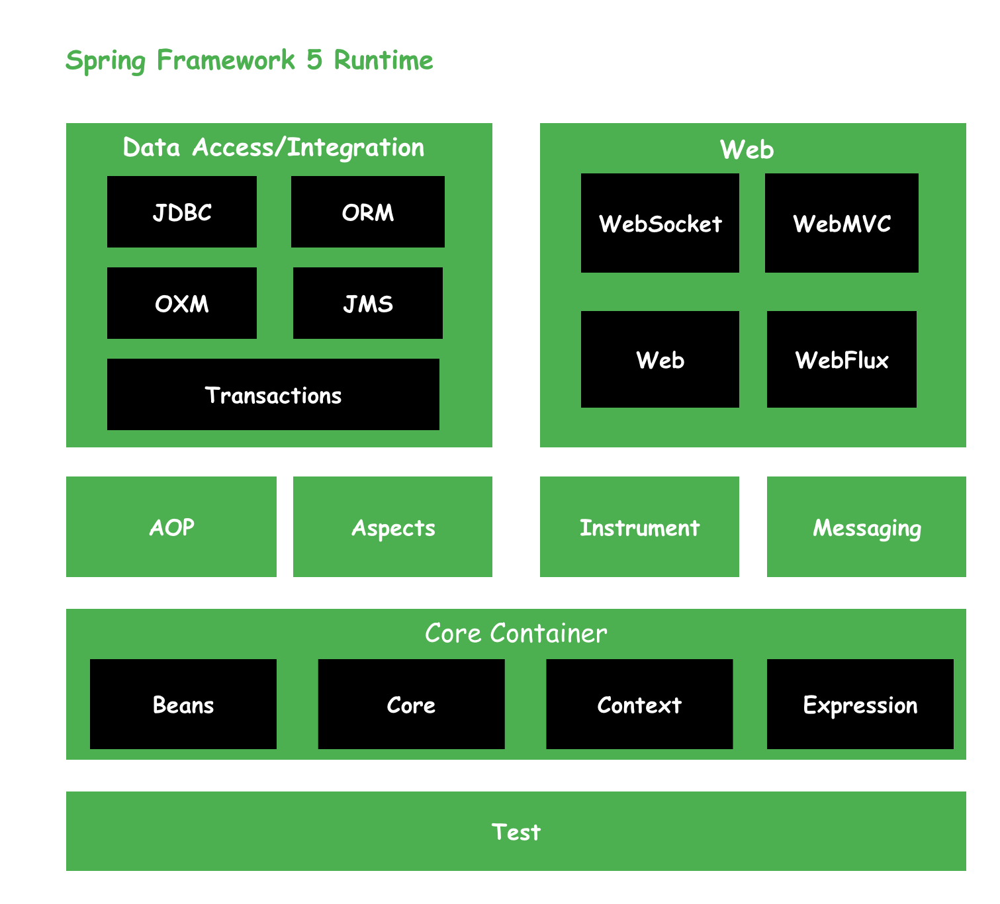
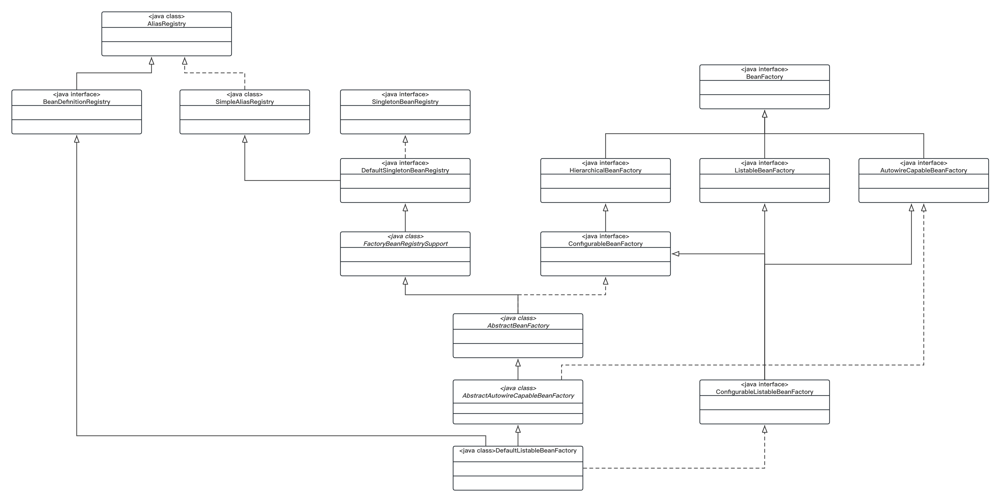
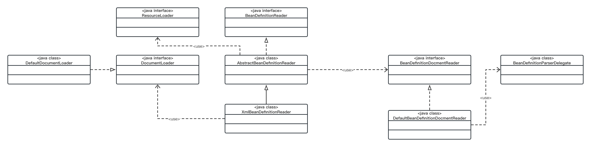
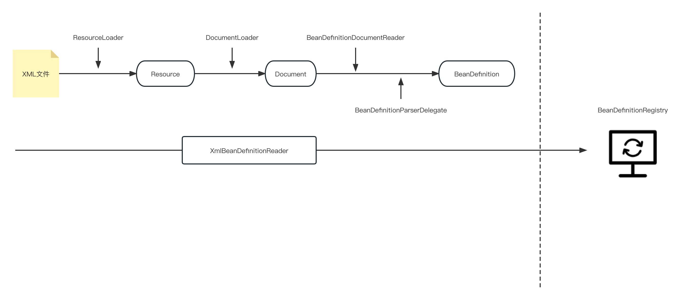

# 【spring源码分析】之SpringFramework简介

## 一、Spring Framework概览

> 它使创建Java企业应用程序变得更容易，它提供了在企业环境中使用Java语言所需的一切，支持Groovy和Kotlin作为JVM上的替代语言，并且可以根据应用程序的需要灵活地创建多种体系结构。Spring对速度、简单性和生产力的关注使其成为世界上最受欢迎的Java框架。

Spring Framework提供的特性如下图所示：

- Core Container: Spring核心特性，包括IoC容器、事件(Events)、资源(Resources)、国际化(i18n)、数据校验(Data Validation)、数据绑定(Data Binding)、类型转换(Type Conversions)、面向切面编程(AOP)、Spring表达式(SpEL)
- Test: Mock对象，TestContext框架、Spring MVC测试、Web测试客户端
- Data Access: 提供对数据存储方面的支持，例如事务管理(Transactions)、DAO支持(DAO Support)、JDBC抽象、O/R映射(O/R Mapping)、XML编列(XML Marshalling)
- Web Servlet: 提供对Web服务的支持，在Servlet技术栈，提供Spring MVC、WebSocket、SockJS
- Web Reactive: 提供对Web服务的支持，在Reactive技术栈，提供Spring WebFlux、WebSocket、WebClient
- Integration: 对各项技术的整合，远程调用(Remoting)、Java消息服务(JMS)、Java链接架构(JCA)、Java管理扩展(JMX)、Java邮件客户端(Email)、本地任务(Tasks)、本地调度(Scheduling)、缓存抽象(Caching)、Spring测试(Test)

## 二、Spring核心模块及其依赖关系

### 1、Spring IoC

- spring-beans module
  - 提供底层IoC容器BeanFactory核心组件实现，它是工厂模式的典型应用之一。通过控制反转，将对象的创建与对象的使用分离开来。下面来介绍下几个核心组件
  - DefaultListableBeanFactory-底层IoC容器的核心实现类
    - 
    - AliasRegistry: 定义对Alias的增删查等操作
    - BeanDefinitionRegistry: 定义对BeanDefinition的增删改查等操作
    - SimpleAliasRegistry: 使用ConcurrentHashMap作为缓存存储Alias，对AliasRegistry定义的接口进行实现
    - SingletonBeanRegistry: 定义对单例Bean的注册与获取等操作
    - DefaultSingletonBeanRegistry: 对SingletonBeanRegistry定义各函数进行实现
    - FactoryBeanRegistrySupport: 在DefaultSingletonBeanRegistry的基础上，提供对FactoryBean的支持
    - BeanFactory: 定义获取Bean以及Bean的各种属性
    - HierarchicalBeanFactory: 继承BeanFactory，在BeanFactory提供的函数的基础上，提供对parentFactory的支持
    - ListableBeanFactory: 继承BeanFactory，在BeanFactory的基础上，提供对获取Bean集合的支持
    - AutowireCapableBeanFactory: 在BeanFactory的基础上，定义Bean实例化、自动注入、初始化以及应用BeanPostProcessor后置处理器等操作
    - ConfigurableBeanFactory: 在HierarchicalBeanFactory的基础上，定义配置BeanFactory的各种操作
    - AbstractBeanFactory: 综合FactoryBeanSupport & ConfigurableBeanFactory的各种功能
    - AbstractAutowireCapableBeanFactory: 继承AbstractBeanFactory，提供相关功能实现，并且实现AutowireCapableBeanFactory定义的相关函数
    - DefaultListableBeanFactory: 综合上面所有功能，主要是对Bean注册后的处理
  - XmlBeanDefinitionReader-Xml配置文件读取器
    - 
    - BeanDefinitionReader: BeanDefinition读取器，定义资源文件读取并转换为BeanDefinition的各个功能
    - ResourceLoader: 资源加载器，主要应用于根据给定的资源路径返回对应的Resource
    - DocumentLoader: Document加载器，定义从资源文件加载转换到Document的功能
    - DefaultDocumentLoader: DocumentLoader的默认实现
    - AbstractBeanDefinitionReader: 对BeanDefinitionReader定义的函数进行实现，另外也涉及实现EnvironmentCapable接口的实现(不进一步讨论)
    - XmlBeanDefinitionReader: 继承AbstractBeanDefinitionReader，实现从xml读取资源的功能
    - BeanDefinitionDocumentReader: 定义读取Document并转换注册BeanDefinition的功能
    - DefaultBeanDefinitionDocumentReader: BeanDefinitionDocumentReader的默认实现
    - BeanDefinitionParserDelegate: 提供对各种Element标签的解析
    - 
- Spring-context module
  - 该模块是通过ApplicationContext实现对底层IoC容器-BeanFactory的扩展，提供企业级功能(如事件机制、国际化文案等)。
  - 

## 三、